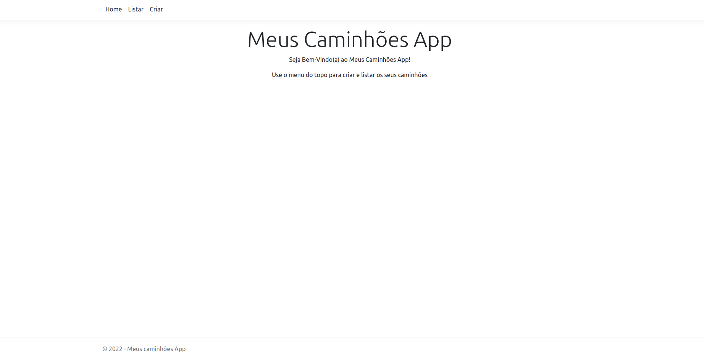
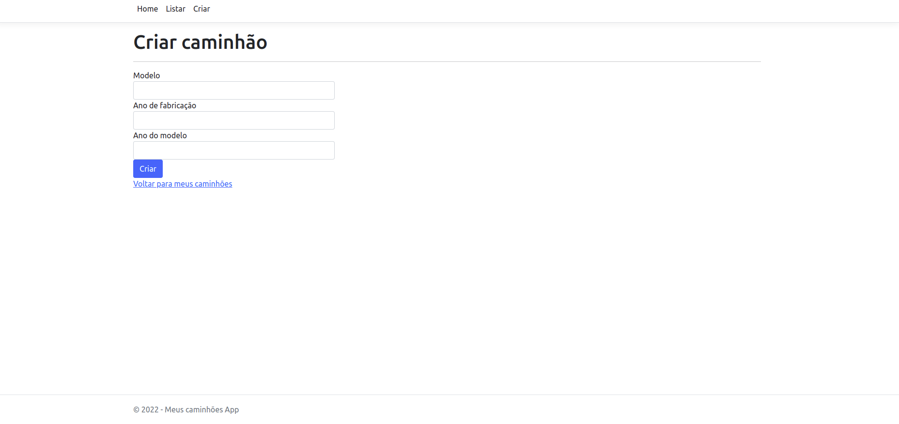
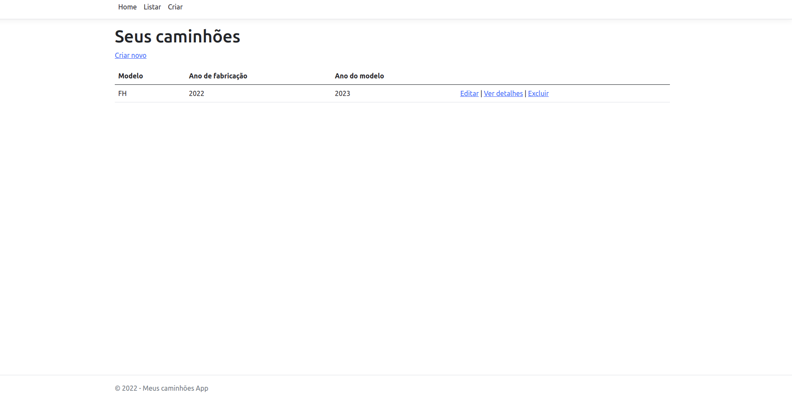
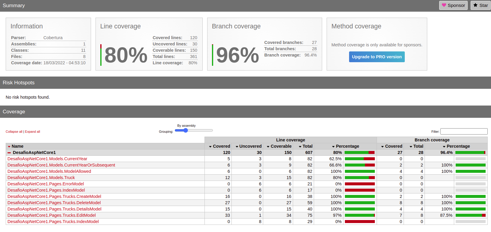

# Desafio ASP.NET Core

## Sobre

O objetivo deste projeto foi desenvolver um app web de gerenciamento de caminhões com ASP.NET Core que tinham como
requisitos principais:

- Visualizar os caminhões cadastrados;
    - As propriedades mínimas do caminhão deverão ser:
        - Modelo (Poderá aceitar apenas FH e FM)
        - Ano de Fabricação (Ano deverá ser o atual)
        - Ano Modelo (Poderá ser o atual ou o ano subsequente)
- Atualizar as informações de um caminhão;
- Excluir um caminhão;
- Inserir um novo caminhão.

Requisitos secundários:

- Poderão existir vários modelos de caminhões.
    - Os modelos permitidos serão somente (FH e FM)

- Utilizar ASP.NET Core;
- Utilizar base de dados local;
- Utilizar ORM para mapear as tabelas de base de dados
    - Utilizar “Migrations” para criação da base de dados;
    - A criação da base de dados deverá ser automática (sem a necessidade de utilizar algum comando adicional).
- Criar testes unitários (Cobrir ao menos 80% dos fluxos)

## Execução

Todo o projeto está baseado no [.NET 6.0](https://docs.microsoft.com/pt-br/dotnet/core/install). Também é necessário o
terminal [Git](https://docs.github.com/pt/authentication/connecting-to-github-with-ssh/generating-a-new-ssh-key-and-adding-it-to-the-ssh-agent)
com SSH configurado para fazer o clone do projeto.

```
git clone git@github.com:lripardo/DesafioAspNetCore1.git
```

```
cd DesafioAspNetCore1
```

Para executar a aplicação:

```
dotnet run --project DesafioAspNetCore1
```

O servidor irá abrir por padrão em <http://localhost:5213> ou no link em que o console indicar.

Após abrir o link, esta será a página inicial:



No menu do topo, clique em [Criar](http://localhost:5213/Trucks/Create) para adicionar um caminhão no banco de dados.



As validações estão aplicadas de acordo com os requisitos então preencha todos os campos corretamente e clique no
botão "Criar". Após o processo você será redirecionado para a lista de caminhões onde poderá ver o seu recém cadastrado
veículo.



Os processos de exclusão, edição e visualização são autoexplicativos no ambiente.

## Testes unitários

O seguinte comando irá executar os testes e salvar um arquivo de cobertura:

```
dotnet test --collect:"XPlat Code Coverage" --settings coverlet.runsettings
```

Após isso, um arquivo de cobertura será gerado na pasta DesafioAspNetCore1.Tests/TestResults. Copie o GUID da pasta que
foi gerada, verifique se dentro dela há um arquivo chamado coverage.cobertura.xml. Caso o arquivo exista, execute o
pŕoximo comando substituindo o {GUID} pelo seu real GUID que foi gerado pelo comando anterior.

```
reportgenerator -reports:"$(pwd)/DesafioAspNetCore1.Tests/TestResults/{guid}/coverage.cobertura.xml" -targetdir:"$(pwd)/DesafioAspNetCore1.Tests/TestResults/Report" -reporttypes:Html
```

Será gerado dentro da pasta Report um arquivo chamado index.html, abra e veja o relatório completo de cobertura. Este
relatório se parecerá com esse:


## Principais ferramentas e tecnologias

- Ubuntu 20.04.4 LTS
- .NET 6.0
- Entity Framework
- SQLite
- Moq
- XUnit
- NuGet
- Coverlet

## Outros

- Assinatura de commits com GPG
- Commit Semântico
- Migração automática no início do app
- Os validadores da classe [Truck](DesafioAspNetCore1/Models/Truck.cs) foram customizados herdando da
  classe [ValidationAttribute](https://docs.microsoft.com/pt-br/dotnet/api/system.componentmodel.dataannotations.validationattribute?view=net-6.0)
- Controle dos arquivos versionados com [.gitignore](.gitignore)

```
# Para criar o arquivo padrão do .NET
dotnet new gitignore
```

- Comandos de migração

```
dotnet ef migrations add NomeDaMigracao
```

```
dotnet ef database update
```